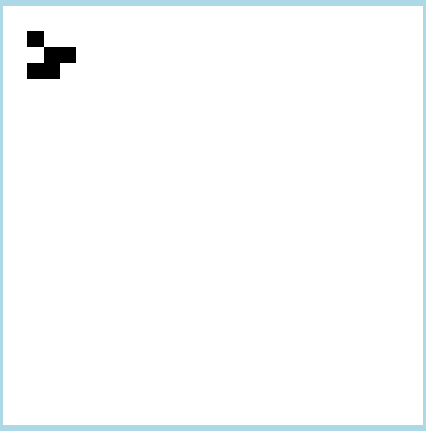

# Evaporating image

Using setup like this


To render something like this:

 

This project setups a stack using [polytope](https://polytope.dev/) to run an overengineered web page with evaporating image using Golang, Python, Redis and polytope. You'll need docker installed to run polytope stack. If you intend to allow people outside of your laptop to trigger the canvas updates, you'll need public domain connected to corresponding port. For this, you can use [ngrok](https://ngrok.com/blog-post/free-static-domains-ngrok-users) or setup something similar yourself.

To run this example, start by installing [polytope](https://polytope.dev/docs/quick-start), copy [ngrox.yml.template](conf/ngrok.yml.template) to `conf/ngrok.yml` and edit accordingly, and then execute

```bash
pt run stack
```

(you would need docker installed and running on your machine for polytope to work, refer to the docs above if you run into troubles) 

Then point your webbrowser to [http://localhost](http://localhost). Doing `curl localhost:4000` should render some pixels on the canvas, and you can use `curl localhost:4000/full` or `localhost:4000/clear` to render full picture or clean the canvas, correspondingly.

One can argue that the setup is overengineered but it's actually okay since the point is to showcase how to use polytope with custom images in multi-language environment.

[Read more](https://moose.rodeo/posts/evaporating-image-polytope/) about all this in my blog post.

