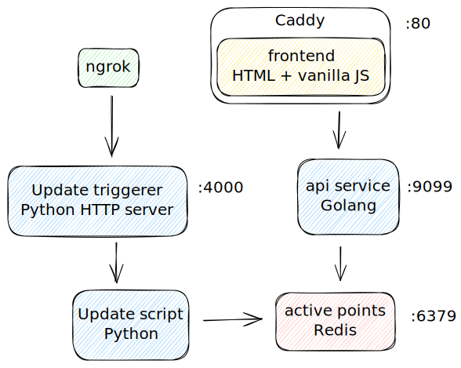

# Evaporating image

This project setups a stack using [polytope](https://polytope.dev/) to run an overengineered web page with evaporating image using Golang, Python, Redis and polytope. To run this, you'll need docker installed. If you intend to allow people outside of your laptop to trigger the picture updates, you'll need static domains provided by [ngrok](https://ngrok.com/blog-post/free-static-domains-ngrok-users) or setup something similar yourself.

To run this example, start by installing [polytope](https://polytope.dev/docs/quick-start), copy/edit [ngrox.yml](conf/ngrok.yml.template) and edit `polytope.yml` and execute

```bash
pt run stack
```

Then point your webbrowser to [https://localhost](https://localhost). You can [read more](https://moose.rodeo/posts/evaporating-image-polytope/) about this in my blog post.

One can argue that the setup is overengineered but it's actually okay since the point is to showcase how to use polytope with custom images in multi-language environment. Here's a full scheme of this solution



